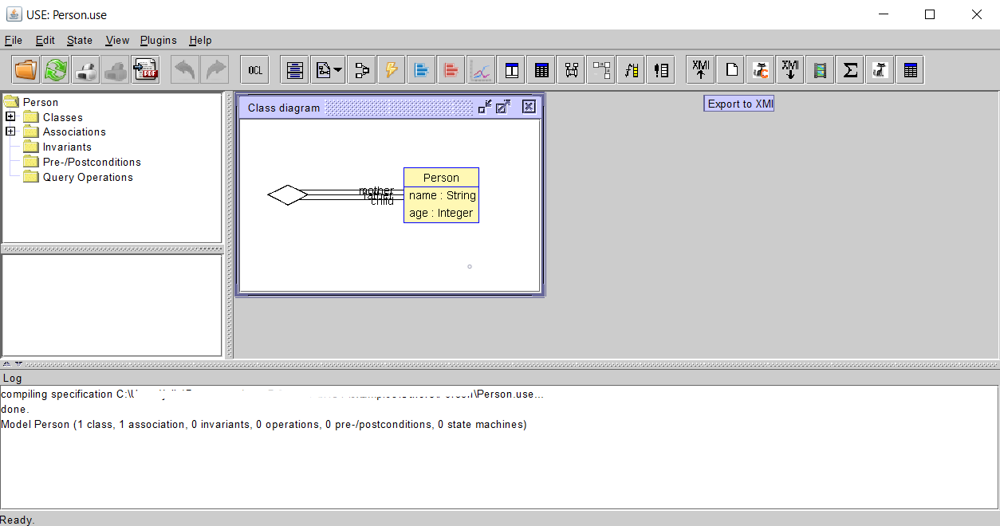
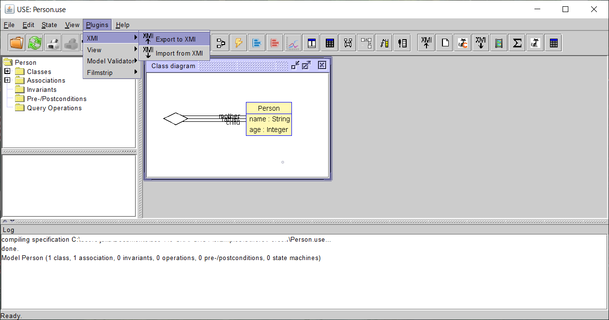
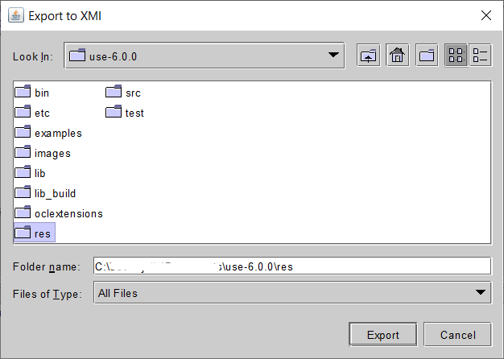
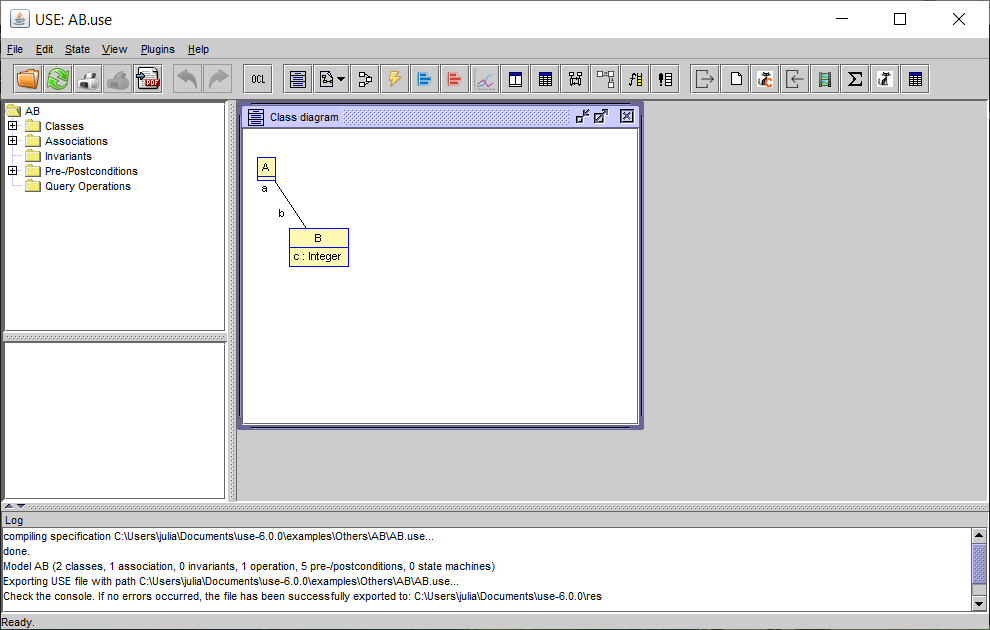

# XMI Converter Plugin For USE

This plugin has been created in order to facilitate the exchange of models created in USE. Specifically, it allows the export and import of the [XMI format](https://www.omg.org/spec/XMI/), the standard most frequently used by software modelling tools.

Since XMI is a standard, there are several implementations of it. In this particular case, the **Eclipse UML2 (v5.x) XMI** implementation has been chosen for both exporting and importing. It is possible that other implementations may be compatible with the plugin, but this cannot be guaranteed.

This plugin has been tested especially for use in conjunction with the [MagicDraw modelling tool](https://www.3ds.com/products-services/catia/products/no-magic/magicdraw/), although it may be valid for other tools.

The development of this plugin comes from a final year project, in whose [Github](https://github.com/juliarobles/model-converter) you can find more details about its development and the source code corresponding to the [modelConverter.use_languageSINANTLR.jar](lib/modelConverter.use_languageSINANTLR.jar) used.

## Table of Contents
- [Installation](#installation)
- [Compilation](#compilation)
- [Limitations of conversion](#limitations-of-conversion)
- [Usage](#usage)
  - [Export to XMI](#export-to-xmi)
  - [Import to XMI](#import-from-xmi)

## Installation

To install the plugin you simply download the [JAR file](dist/XMIConverter-7.0.0.jar) and drag it into the `lib/plugins` folder in the main USE directory.

## Compilation

If you would like to compile the plugin yourself, follow the steps below:
1. Clone or download this repository.
2. Import the project into Eclipse by using `File > Import > Git > Projects from Git > Existing local repository`
3. Once loaded, select the [build.xml](build.xml) file and in its options choose `Run As > Ant Build`.
4. If the compilation is successful, you can find the generated files in the [dist folder](dist).

## Limitations of conversion

The plugin has some limitations regarding the models it can convert, inherited from the possibilities offered by the Xtext tool and the features of the USE language.
Regarding the export to XMI there are the following constraints:

- *N-ary relations in USE*. Due to the design of n-ary relationships in Eclipse UML2 XMI, it is complex to generate associations of that style from USE, so we have opted to consider all of them in USE. has been chosen to consider all of them as binary in this language. This affects both the members of the association and its multiplicities. Of the latter only the first ones in the list are taken into account.
- *Collections of more than one type*. USE allows collections to be of more than one type, whereas XMI only allows a single type to be assigned. Therefore, if a collection of this kind is received, only the first of them will be considered.

Regarding the import from XMI there are:

- *Information loss.* The difference in detail between the USE models and those that XMI is able to represent disables the conversion of some, but not the most important, information.
- *Composite or sub-machine state machines.* The USE grammar does not allow them, so the machine would have to be adapted in such a way that they form a single machine. This is currently not implemented.

In any case, the plugin is capable of transforming a large part of the model, allowing the user to manually edit the resulting file if the result is not optimal.

## Usage

### Export to XMI

To export, simply load the model to be transformed in the USE tool and click on the *Export to XMI* button in the main bar or choose `Plugins > XMI > Export to XMI` from the top menu.

Button in main bar             |  Top menu
:-------------------------:|:-------------------------:
  |  

Then you have to select where you want to save the generated XMI file. Then you have to select where you want to save the generated XMI file and once you have clicked on the *Export* button the process will start. Check the USE console to make sure there are no errors (warnings are not a problem) and, if so, you will have exported the model succesfully.

File chooser             |  Console output
:-------------------------:|:-------------------------:
 |  

### Import from XMI

<!--

-->

