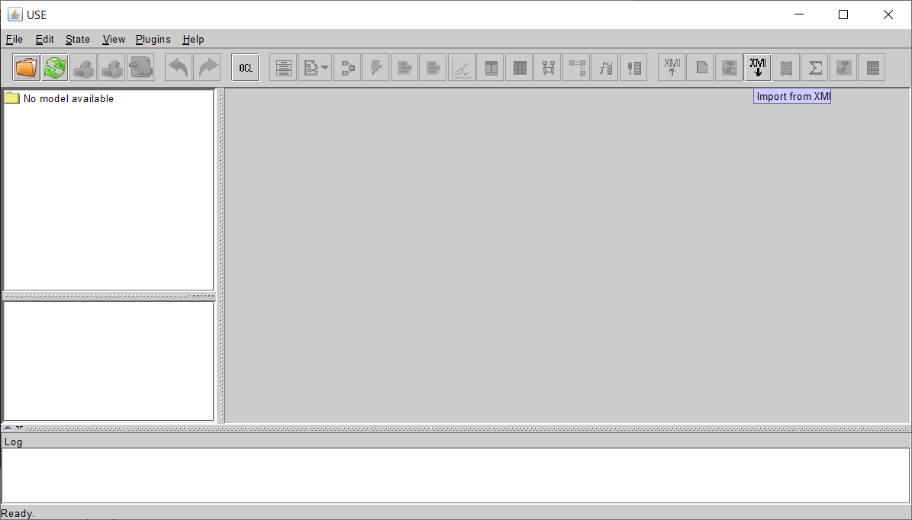
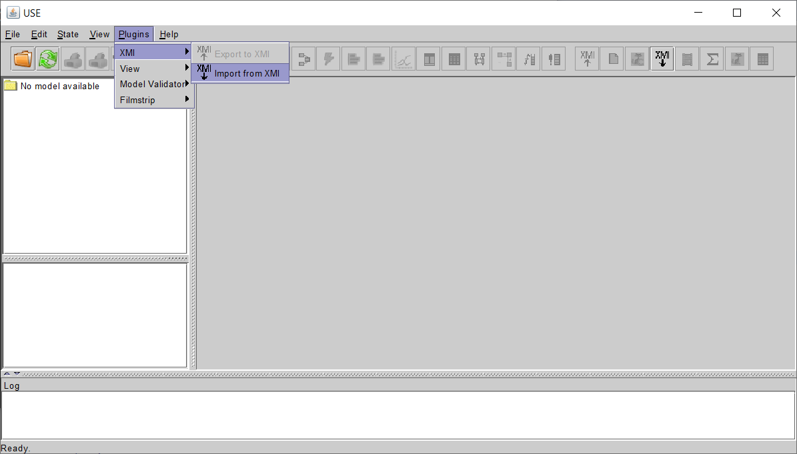
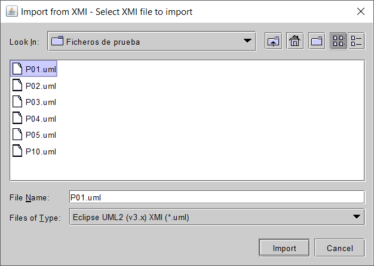
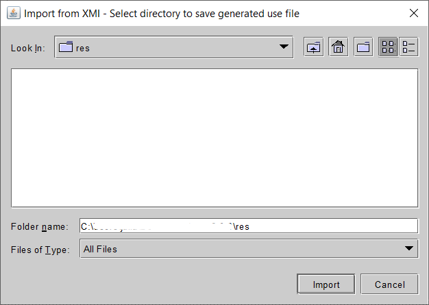
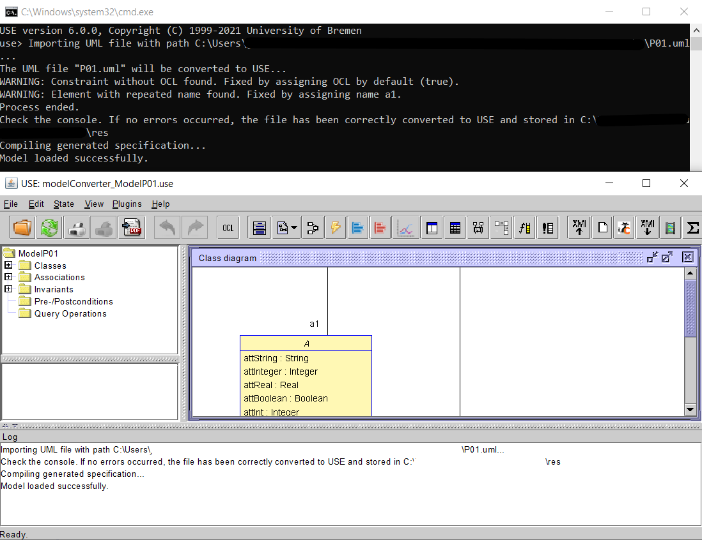
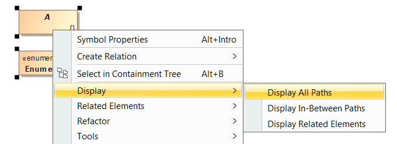

# XMI Converter Plugin For USE

This plugin has been created in order to facilitate the exchange of models created in USE. Specifically, it allows the export and import of the [XMI format](https://www.omg.org/spec/XMI/), the standard most frequently used by software modelling tools.

Since XMI is a standard, there are several implementations of it. In this particular case, the **Eclipse UML2 (v5.x) XMI** implementation has been chosen for both exporting and importing. It is possible that other implementations may be compatible with the plugin, but this cannot be guaranteed.

This plugin has been tested especially for use in conjunction with the [MagicDraw modelling tool](https://www.3ds.com/products-services/catia/products/no-magic/magicdraw/), although it may be valid for other tools.

The development of this plugin comes from a final year project, in whose [Github](https://github.com/juliarobles/model-converter) you can find more details about its development and the source code corresponding to the [modelConverter.use_languageSINANTLR.jar](lib/modelConverter.use_languageSINANTLR.jar) used.

## Table of Contents
- [Installation](#installation)
- [Compilation](#compilation)
- [About conversion](#about-conversion)
  - [Limitations](#limitations)
- [Usage](#usage)
  - [Export to XMI](#export-to-xmi)
  - [Import to XMI](#import-from-xmi)
    - [Recommendations for accurate import](#recommendations-for-accurate-import)
  - [Extra: Integration with MagicDraw](#extra-integration-with-magicdraw)

## Installation

To install the plugin you simply download the [JAR file](dist/XMIConverter-7.0.0.jar) and drag it into the `lib/plugins` folder in the main USE directory. 

*Note*: This version of the plugin has been compiled for USE 7.0.0 libraries with Java 14, although it should work on USE 6.0.0. In case it doesn't work correctly use this [JAR file](dist/XMIConverter.jar), which has been compiled with USE 6.0.0 and Java 8 libraries.

## Compilation

*Note*: This repository uses [Git LFS](https://git-lfs.github.com/) to save space in it.

If you would like to compile the plugin yourself (it is not necessary), follow the steps below:
1. Install [Git](https://git-scm.com/) and [Git LFS](https://git-lfs.github.com/) (using `git lfs install --skip-smudge` to avoid always downloading LFS files).
2. Clone the repository if you don't want the LFS files or clone [this repository](https://github.com/juliarobles/XMIPluginUSE-LFS) (it's a mirror of it) if you want them (Github doesn't allow using LFS in forks).
3. Run the `git lfs pull` command to load the LFS files. 
4. Import the project into Eclipse by using `File > Import > Git > Projects from Git > Existing local repository`
5. Once loaded, select the [build.xml](build.xml) file and in its options choose `Run As > Ant Build`.
6. If the compilation is successful, you can find the generated files in the [dist folder](dist).

## About conversion

The converter is capable of transforming classes, enumerations, attributes, operations, constraints, associations, association classes and state machines from one or more models of one language to another, with few limitations. In addition, it is able to correct common model errors such as unnamed or repeated elements, although it is not recommended to keep these mistakes.

After the execution, in both cases the generated file can be found in the selected folder, with the name *modelConverter_X*, where X is the name of the model and not the name of the original file. If a file with this name already existed, an (N) will have been added, where N is the number of other files with the same name. For example, if a USE model is converted which indicates in its first line `model test` and which has already been converted twice before, the name of the generated file will be *modelConverter_test(2).uml*.

If warnings or errors are found, these will be displayed by console. In case of errors, no file will be generated, as the received file cannot be read as it is not valid. Warnings, on the other hand, only warn the user of the errors that have been found in the model and how they have been corrected, in case the user would like to fix them in the original model.

### Limitations

The plugin has some limitations regarding the models it can convert, inherited from the possibilities offered by the Xtext tool and the features of the USE language.
Regarding the export to XMI there are the following constraints:

- *N-ary relations in USE*. Due to the design of n-ary relationships in Eclipse UML2 XMI, it is complex to generate associations of that style from USE, so we have opted to consider all of them in USE. has been chosen to consider all of them as binary in this language. This affects both the members of the association and its multiplicities. Of the latter only the first ones in the list are taken into account.
- *Collections of more than one type*. USE allows collections to be of more than one type, whereas XMI only allows a single type to be assigned. Therefore, if a collection of this kind is received, only the first of them will be considered.

Regarding the import from XMI there are:

- *Information loss.* The difference in detail between the USE models and those that XMI is able to represent disables the conversion of some, but not the most important, information.
- *Composite or sub-machine state machines.* The USE grammar does not allow them, so the machine would have to be adapted in such a way that they form a single machine. This is currently not implemented.

In any case, the plugin is capable of transforming a large part of the model, allowing the user to manually edit the resulting file if the result is not optimal.

## Usage

### Export to XMI

To export, simply load the model to be transformed in the USE tool and click on the *Export to XMI* button in the main bar or choose `Plugins > XMI > Export to XMI` from the top menu.

Button in main bar             |  Top menu
:-------------------------:|:-------------------------:
  |  

Then you have to select where you want to save the generated XMI file. Then you have to select where you want to save the generated XMI file and once you have clicked on the *Export* button the process will start. Check the USE console to make sure there are no errors (warnings are not a problem) and, if so, you will have exported the model succesfully.

File chooser             |  Console output
:-------------------------:|:-------------------------:
 |  

### Import from XMI

The import will depend on the version of USE you have. **If the version is lower than 7.0.0 it will be necessary to load any model in the tool to enable the import option**. With option 7.0.0 or higher the option should be enabled. In the first case don't worry because the loaded model will not be overwritten or damaged by the import: the imported model will be written to a new file where you choose. However, if there is a model loaded in the tool, a warning appears that the imported file will be loaded, so unsaved changes to the loaded model will be lost.

Button in main bar             |  Top menu
:-------------------------:|:-------------------------:
  |  

Once the button has been clicked, a file selector will appear where the UML file to be imported must be selected. After that we must select where to save the USE file that will be generated with the import. 

First choose the file             |  Then where to save the generated file
:-------------------------:|:-------------------------:
  |  

If the import was successful, no error messages should appear in the console (warnings are not a problem) and the model should have loaded automatically into the tool. 

*Note*: It may be the case that, due to the [limitations of conversion](#limitations), the resulting file cannot be loaded into the tool. In that case you can take advantage of the generated file and correct it manually.

 

#### Recommendations for accurate import 

In the models coming from XMI, certain guidelines must be followed to ensure their correct import to USE, since if the information is not entered in the corresponding fields, it will not be taken into account. Most fields coincide with the name of the element they represent, so only those that are not directly related will be discussed.

Firstly, you must avoid at all costs repeating element names or leaving them empty. Similarly, attributes without type and enumerated attributes without values should not be left. All this is checked and modified in the application, so there should not really be any problem, but it is always convenient to have the model as complete as possible and avoid this kind of mistakes.

On the other hand, if you want to create attributes or parameters that contain sets, sequences or bags, you must first set the maximum multiplicity of the attribute to any one greater than 1. Furthermore, for a sequence you will have to mark the field *Is Ordered* while for a set it will be the field *Is Unique*. **In case both fields are false, it will be a bag, and if both are true, the preference will be for the sequence**.

If you would like to add SOIL or OCL code to the operations, it must be entered in the *Body Condition* field. Similarly, to initialise attributes, the *Default Value* field must be used and, if the attribute is derived, the expression will be added to the same field and the *Is Derived* field will be activated. Likewise, all constraints must contain their OCL expression in the *Specification* field.

Finally, as far as state machines are concerned, the plugin only imports *Protocol State Machines*.

### Extra: Integration with MagicDraw

Since this plugin has been tested together with MagicDraw, I think it is useful to clarify certain aspects that can help their combined use. 

Both for importing and exporting it is recommended to select the **Eclipse UML2 (v5.x) XMI File** option. 

When **exporting** MagicDraw generates several files, but we are only interested in the uml file with the name of the model (for example *Model.uml*). 

As for the **import**, all the elements of the model will be loaded, although they will not be placed directly in the diagram. From this point on, the user only has to design the diagram as he/she likes, having all the elements completed. An easy way to do this is, after creating the diagram object using the *Create Diagram* button, select all the elements except the relationships and drag them to the diagram, then select all of them in the diagram and `right click > Display > Display All Paths`. This will place all the existing relationships between the classes. If the result is not visually pleasing, you can always modify or place them one by one from the content tree.

 

